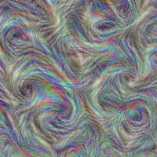

# Caffe2 C++ Tutorials and Examples

*C++ transcripts of the Caffe2 Python tutorials and other C++ example code.*

## About

Caffe2 has a strong C++ core but most tutorials only cover the outer Python layer of the framework. This project aims to provide example code written in C++, complementary to the Python documentation and tutorials. It covers verbatim transcriptions of most of the Python tutorials and other example applications.

Some higher level tools, like brewing models and adding gradient operations are currently not available in Caffe2's C++. This repo therefore provides some model helpers and other utilities as replacements, which are probably just as helpful as the actual tutorials. You can find them in [include/caffe2/util](include/caffe2/util) and [src/caffe2/util](src/caffe2/util).

Check out the original Caffe2 Python tutorials at [https://caffe2.ai/docs/tutorials.html](https://caffe2.ai/docs/tutorials.html).

## Tutorials

1. [Intro Tutorial](#intro-tutorial)
2. [Toy Regression](#toy-regression)
3. [Pre-trained models](#loading-pre-trained-models)
4. [MNIST from scratch](#mnist---create-a-cnn-from-scratch)
5. [RNNs and LSTM](#rnns-and-lstm-networks)
6. [ImageNet Classifiers](#imagenet-classifiers)
7. [Fast Retrain](#fast-retrain)
8. [Training from scratch](#training-from-scratch)
9. [Deep Dream](#deep-dream)

## Build

1. Install dependencies

    Install the dependencies CMake, leveldb and OpenCV. If you're on macOS, use Homebrew:

        brew install cmake glog protobuf leveldb opencv eigen

    On Ubuntu:

        apt-get install cmake libgoogle-glog-dev libprotobuf-dev libleveldb-dev libopencv-dev libeigen3-dev

    In case you're using CUDA an run into CMake issues with `NCCL`, try adding this to your `.bashrc` (assuming Caffe2 at `$HOME/caffe2`):

        export CMAKE_LIBRARY_PATH=$CMAKE_LIBRARY_PATH:$HOME/caffe2/third_party/nccl/build/lib

2. Install Caffe2

    Follow the Caffe2 installation instructions: [https://caffe2.ai/docs/getting-started.html](https://caffe2.ai/docs/getting-started.html)

3. Build using CMake

    This project uses CMake. However easiest way to just build the whole thing is:

        make

    Internally it creates a `build` folder and runs CMake from there. This also downloads the resources that are required for running some of the tutorials.

    Check out the [Build alternatives](#build-alternatives) section below if you wish to be more involved in the build process.

Note: sources are developed and tested on macOS and Ubuntu.

## Intro Tutorial

The [Intro Tutorial](https://caffe2.ai/docs/intro-tutorial.html) covers the basic building blocks of Caffe2. This tutorial is transcribed in [intro.cc](src/caffe2/binaries/intro.cc).

Make sure to first run `make`. Then run the intro tutorial:

    ./bin/intro

This should output some numbers, including a `loss` of about `2.2`.

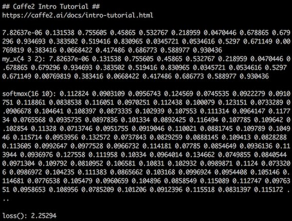

## Toy Regression

One of the most basic machine learning tasks is linear regression (LR). The [Toy Regression](https://caffe2.ai/docs/tutorial-toy-regression.html) tutorial shows how to get accurate results with a two-parameter model. This tutorial is transcribed in [toy.cc](src/caffe2/binaries/toy.cc)

Run the toy regression model:

	./bin/toy

This performs 100 steps of training, which should result in `W after` approximating `W ground truth`.

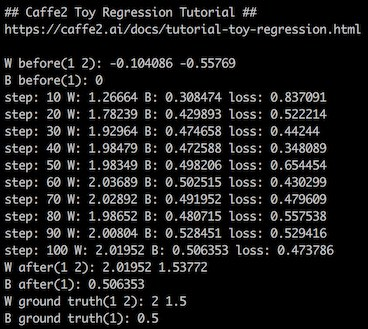

## Loading Pre-Trained Models

Often training can be skipped by using a pre-trained model. The [Model Zoo](https://github.com/caffe2/caffe2/wiki/Model-Zoo) contains a few of the popular models, although many are only available for Caffe. Use [caffe_translator.py](https://github.com/caffe2/caffe2/blob/master/caffe2/python/caffe_translator.py) to convert models to Caffe2. See [Caffe2 Models](https://github.com/leonardvandriel/caffe2_models) for more info.

The [Loading Pre-Trained Models](https://caffe2.ai/docs/tutorial-loading-pre-trained-models.html) tutorial shows how to use these models to classify images. This tutorial and more is covered in [pretrained.cc](src/caffe2/binaries/pretrained.cc). The code takes an input image and classifies its content. By default it uses the image in `res/image_file.jpg`. Make sure the pre-trained [Squeezenet](https://github.com/caffe2/models/tree/master/squeezenet) model is present in `res/squeezenet_*_net.pb`. Note that

To run:

    ./bin/pretrained

This should output something along the lines of `96% 'daisy'`.

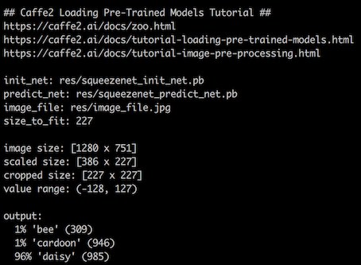

To classify `giraffe.jpg`:

    ./bin/pretrained --image_file giraffe.jpg

This tutorial is also a good test to see if OpenCV is working properly.

See also:

- [Image Pre-Processing](https://caffe2.ai/docs/tutorial-image-pre-processing.html)

## MNIST - Create a CNN from Scratch

A classical machine learning dataset is the [MNIST database of handwritten digits](http://yann.lecun.com/exdb/mnist/) by Yann LeCun. The Caffe2 tutorial [MNIST - Create a CNN from Scratch](https://caffe2.ai/docs/tutorial-MNIST.html) shows how to build a basic convolutional neural network (CNN) to recognize these handwritten digits. This tutorial is transcribed in [mnist.cc](src/caffe2/binaries/mnist.cc). Note that this and following tutorials rely on utility functions defined in [caffe2/util](include/caffe2/util).

Make sure the databases folders `res/mnist-*-nchw-leveldb` are present. These should be generated by the  [download_resource.sh](script/download_resource.sh) script. Then run:

    ./bin/mnist

This performs 100 training runs, which should provide about 90% accuracy.

To see the training in action, run with `--display`:

    ./bin/mnist --display

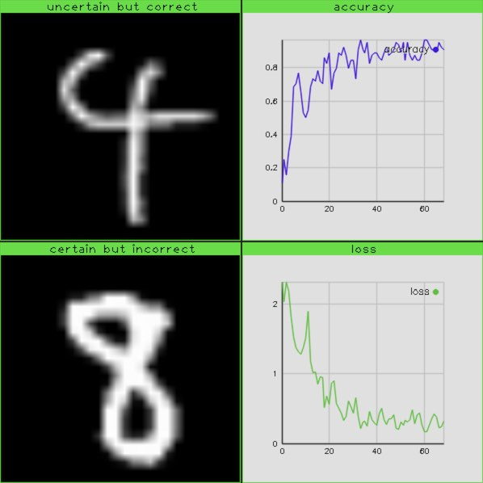

## RNNs and LSTM Networks

In [The Unreasonable Effectiveness of Recurrent Neural Networks](http://karpathy.github.io/2015/05/21/rnn-effectiveness/) Andrej Karpathy describes how to train a recurrent neural network (RNN) on a large volume of text and how to generate new text using such a network. The Caffe2 tutorial [RNNs and LSTM Networks](https://caffe2.ai/docs/RNNs-and-LSTM-networks.html) covers this technique using the [char_rnn.py](https://github.com/caffe2/caffe2/blob/master/caffe2/python/examples/char_rnn.py) script.

This tutorial is transcribed in [rnn.cc](src/caffe2/binaries/rnn.cc). It takes the same parameters as used in the tutorial. First make sure the file `res/shakespeare.txt` is present. Then run:

    ./bin/rnn

In contrast to the tutorial, this script terminates after 10K iterations. To get more, use `--train-runs`:

    ./bin/run --train-runs 100000

To get better results (loss < 1), expand the hidden layer:

    ./bin/rnn --train-runs 100000 --batch-size 32 --hidden-size 512 --seq-length 32

The file `res/dickens.txt` contains a larger volume of text. Because the writing is a bit more recent, it's more challenging to generate convincing results. Also, single newlines are stripped to allow for more creativity.

    ./bin/rnn --train-runs 100000 --batch-size 32 --hidden-size 768 --seq-length 32 --train-data res/dickens.txt

After 200K runs, the loss has not dropped below 36, in contrast to the shakespeare text. Perhaps this requires an additional hidden layer in the LSTM model.

## ImageNet Classifiers

Much of the progress in image recognition is published after the yearly [ImageNet Large Scale Visual Recognition Challenge](http://www.image-net.org/challenges/LSVRC/) (ILSVRC). This competion is based on the [ImageNet](http://www.image-net.org/) dataset, which is a large volume of labeled images of nearly everything. The models for this challenge form the basis of much image recognition and processing research. One of the most basic challenges is classifying an image, which is covered in this example.

To classify the content of an image, run:

    ./bin/imagenet --model <model-name> --image-file <some-image>

Where the model name is one of the following:

* `alexnet`: [AlexNet](https://github.com/BVLC/caffe/tree/master/models/bvlc_alexnet)
* `googlenet`: [GoogleNet](https://github.com/BVLC/caffe/tree/master/models/bvlc_googlenet)
* `squeezenet`: [SqueezeNet](https://github.com/DeepScale/SqueezeNet)
* `vgg16` and `vgg19`: [VGG Team](http://www.robots.ox.ac.uk/~vgg/research/very_deep/)
* `resnet50`, `resnet101`, `resnet152`: [MSRA](https://github.com/KaimingHe/deep-residual-networks)

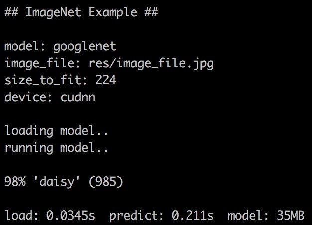

The pre-trained weights for these models are automatically downloaded and stored in the `res/` folder. If you wish to download all models in one go, run:

	./script/download_extra.sh

Additional models can be made available on request!

See also:

- [Model Zoo](https://github.com/caffe2/caffe2/wiki/Model-Zoo)
- [Caffe2 Models](https://github.com/leonardvandriel/caffe2_models)
- [Neural Network Architectures](https://medium.com/towards-data-science/neural-network-architectures-156e5bad51ba)

## Fast Retrain

The article [DeCAF: A Deep Convolutional Activation Feature for Generic Visual Recognition](https://arxiv.org/pdf/1310.1531v1.pdf) describes how to get good results on new datasets with minimal training efforts by reusing trained parameters of an existing model. For example, the above models are all trained on ImageNet data, which means they will only be able to classify ImageNet labels. However, by retraining just the top half of the model we can get high accuracy in a fraction of the time. If the image data has similar characteristics, it's possible to get good results by only retraining the top 'FC' layer.

First divide all images in subfolders with the label a folder name. Then to retrain the final layer of GoogleNet:

    ./bin/train --model googlenet --folder res/images --layer pool5/7x7_s1

The script starts out by collecting all images and running them through the pre-trained part of the model. This allows for very fast training on the pre-processed image data.

If you have more (GPU) power at your disposal retrain VGG16's final 2 layers:

    ./bin/train --model vgg16 --folder res/images --layer fc6

Add `--display` for training visualization:

    ./bin/train --model googlenet --folder res/images --layer pool5/7x7_s1 --display

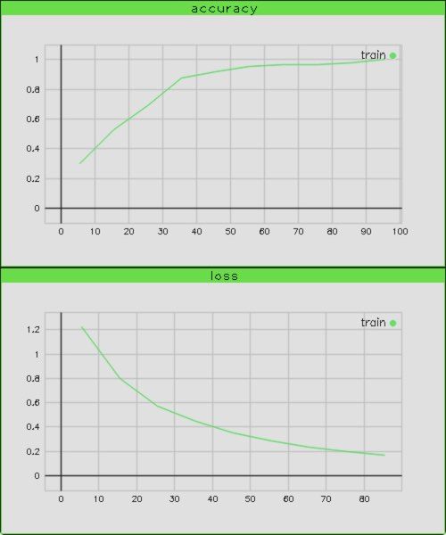

Some models, like SqueezeNet require reshaping of their output to N x D tensor:

    ./bin/train --model squeezenet --folder res/images --layer fire9/concat --reshape-output

You can also provide your own pre-trained model. Specify the location of the init and predict `.pb` file including a `%` character:

    ./bin/train --model res/googlenet_%_net.pb --folder res/images --layer pool5/7x7_s1

See also:

- [How to Retrain Inception's Final Layer for New Categories](https://www.tensorflow.org/tutorials/image_retraining)
- [Train your own image classifier with Inception in TensorFlow](https://research.googleblog.com/2016/03/train-your-own-image-classifier-with.html)

## Training from scratch

To fully train an existing image classification model from scratch, run without the `--layer` option:

    ./bin/train --model googlenet --folder res/images

The models currently available for training are the ones listed in the [ImageNet](#imagenet-classifiers) section. This will take a lot of time even when runnning on the GPU.

Some models, like SqueezeNet require reshaping of their output to N x D tensor:

    ./bin/train --model squeezenet --folder res/images --reshape-output

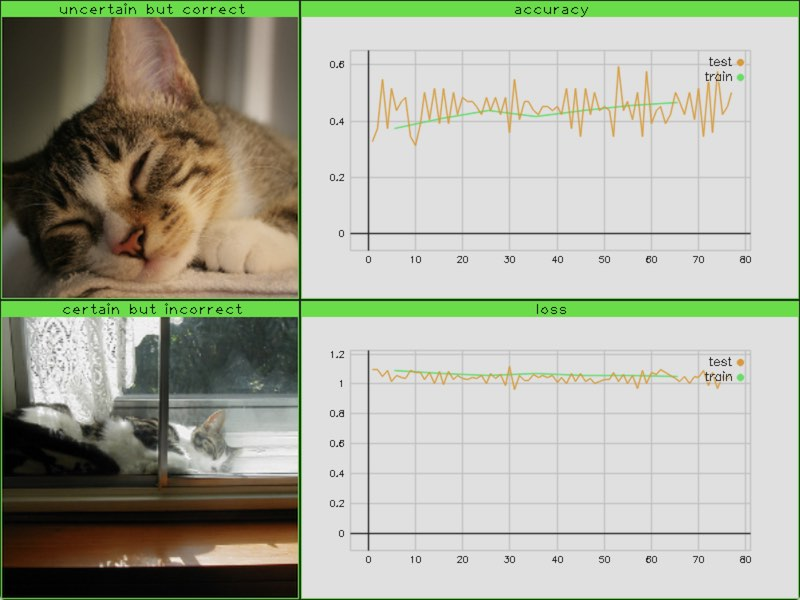

## Deep Dream

The article [Inceptionism: Going Deeper into Neural Networks](https://research.googleblog.com/2015/06/inceptionism-going-deeper-into-neural.html) describes how hidden layers of a CNN can be visualized by training just the the input tensor based on the mean value of a particular channel. This technique is known for producing remarkable imagery and can be combined with existing images. Ths is referred to as Deep Dream.

NB: this code is still a bit buggy and generated images are not representative of the original Deep Dream implementation.

The 139th channel in the `inception_4d/3x3` layer in GoogleNet:

    ./bin/dream --model googlenet --layer inception_4d/3x3_reduce --channel 139

The resulting image will be written to `tmp/`. To visualize the process, add `--display`:

    ./bin/dream --model googlenet --layer inception_4d/3x3_reduce --channel 139 --display

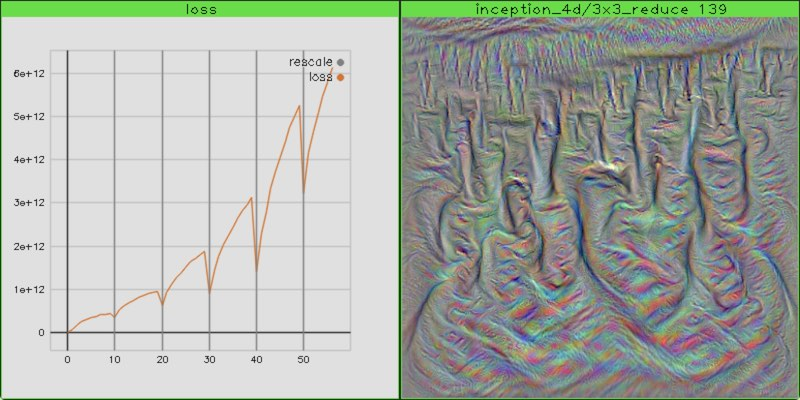

NB: these images differ from the ones presented in Google's article.

Multiple channels can be rendered in parallel by increasing the batch size:

    ./bin/dream --model googlenet --layer inception_4d/3x3_reduce --channel 133 --display --batch 11

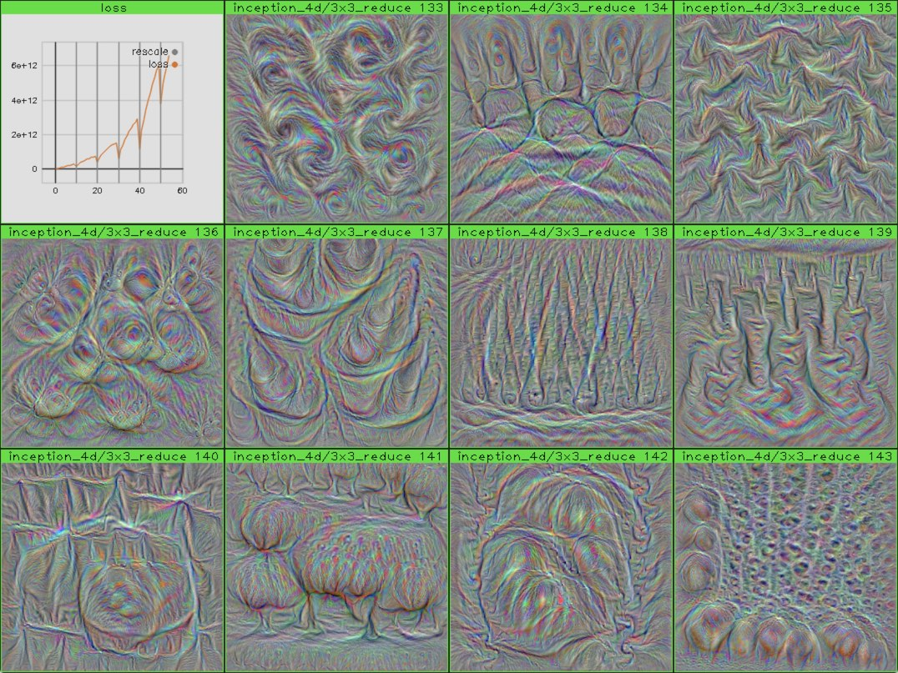

If you have more (GPU) power at your disposal, the first channel in `conv3_1` layer in VGG16:

    ./bin/dream --model vgg16 --layer conv3_1 --channel 0

You can also provide your own pre-trained model. Specify the location of the init and predict `.pb` file including a `%` character:

    ./bin/dream --model res/squeezenet_%_net.pb --layer fire9/concat --channel 100 --display

See also:

- [Pre-rendered Inception](http://storage.googleapis.com/deepdream/visualz/tensorflow_inception/index.html)
- [Pre-rendered VGG16](http://storage.googleapis.com/deepdream/visualz/vgg16/index.html)
- [Deep Dreams (with Caffe)](https://github.com/google/deepdream/blob/master/dream.ipynb)

## Plots

Some of the examples have a `--display` option, which will show an OpenCV window with images and plots covering the training progress. This windows and plots mini framework is defined in [window.h](include/caffe2/util/window.h) and [plot.h](include/caffe2/util/plot.h). To see a short demo, run:

    ./bin/plot

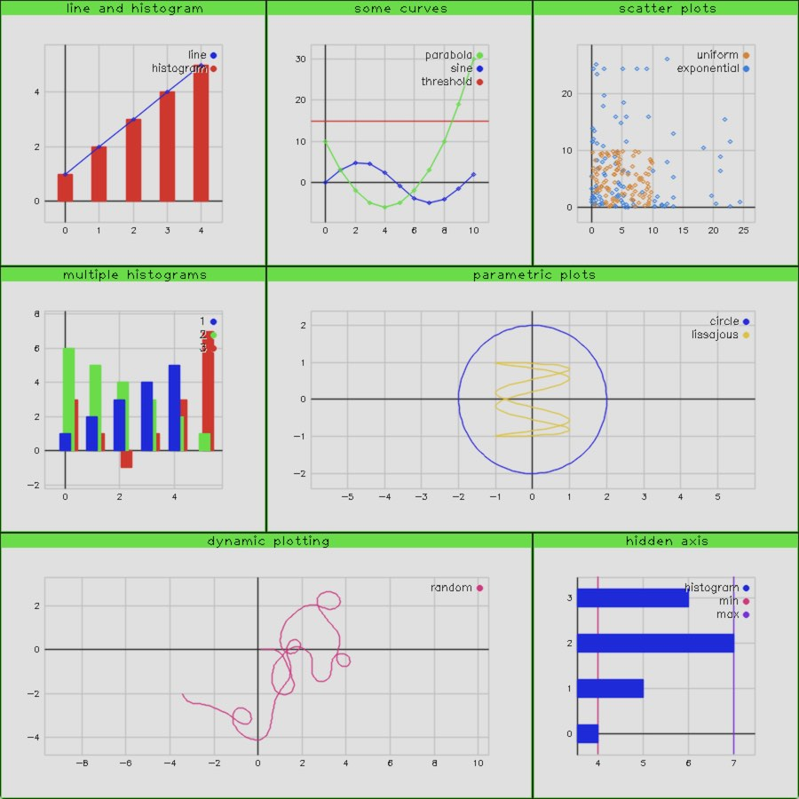

The style of windows and colors are intentionally pale and pixelated to give a dated feel to the whole thing.

## Troubleshooting

See [http://rpg.ifi.uzh.ch/docs/glog.html](http://rpg.ifi.uzh.ch/docs/glog.html) for more info on logging. Try running the tools and examples with `--logtostderr=1`, `--caffe2_log_level=1`, and `--v=1`.

## Build alternatives

The easiest way to build all sources is to run:

    make

To run these steps manually:

    mkdir -p build
    cd build
    cmake ..
    make
    cd ..
    ./script/download_resource.sh

Compiling the tutorials and examples individually can be a little more involved. One way to get more understanding of what CMake does internally is by running:

    cd build
    make VERBOSE=1
    cd ..

The first three tutorials `intro`, `toy`, and `pretrained` can be compiled without CMake quite easily. For example `pretrained` on macOS:

    c++ src/caffe2/binaries/pretrained.cc -o bin/pretrained -std=gnu++11 -Iinclude -I/usr/local/include/eigen3 -I/usr/local/include/opencv -lgflags -lglog -lprotobuf -lopencv_core -lopencv_imgproc -lopencv_highgui -lopencv_imgcodecs -lCaffe2_CPU

And `pretrained` on Ubuntu:

    c++ src/caffe2/binaries/pretrained.cc -o bin/pretrained -std=gnu++11 -Iinclude -I/usr/include/eigen3 -I/usr/include/opencv -lgflags -lglog -lprotobuf -lopencv_core -lopencv_imgproc -lopencv_highgui -lCaffe2_CPU

Other examples require the compilation of additional `.cc` files. Take a look at the verbose output of `cd build && make VERBOSE=1`.

